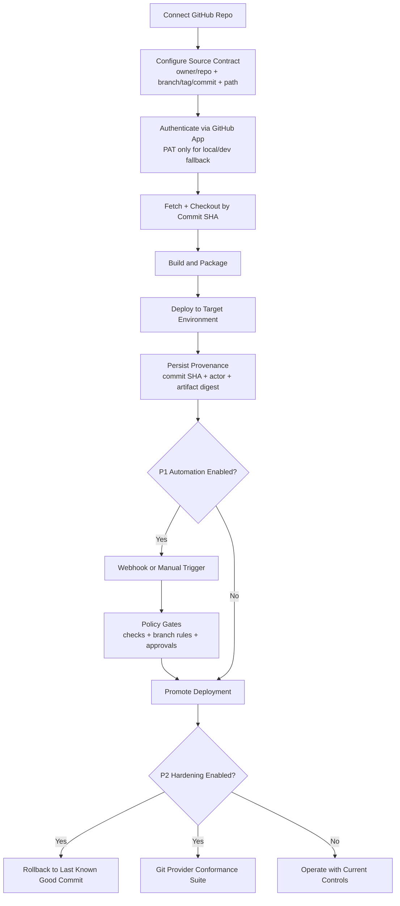

# TODO

## Deferred: Enterprise Production Readiness (Engine Track)

- [ ] Define and freeze v1 engine stability contracts.
  - Scope: CLI flags/output compatibility, run state schema compatibility, extension protocol versioning, and deprecation policy.

- [ ] Introduce a formal reliability target matrix.
  - Goal: define SLOs and error budgets for deploy, workflow execution, invoke, logs, and routing apply paths.

- [ ] Harden workflow and deploy idempotency guarantees.
  - Goal: make retry/replay behavior deterministic across controlplane, provider adapters, and state writes.

- [ ] Add persistent audit trail and provenance for critical operations.
  - Scope: deploy/remove/workflow-run/router-apply with actor identity, reason, correlation ID, and before/after metadata.

- [ ] Enforce policy gates for production actions.
  - Include: environment protection rules, required approvals, blocked dangerous flags, and policy-as-code checks.

- [ ] Implement secrets and key management integration.
  - Targets: AWS Secrets Manager, GCP Secret Manager, Vault.
  - Goal: remove static secret usage in CI and local configs for prod stages.

- [ ] Add multi-tenant safety boundaries.
  - Goal: isolate state, credentials, and execution identities by org/project/environment.

- [ ] Expand disaster recovery and backup strategy.
  - Include: state snapshots, journal restoration drills, run replay recovery tests, and documented RTO/RPO objectives.

- [ ] Build full observability for runtime and controlplane.
  - Scope: traces, metrics, logs, and audit events with standard correlation fields and dashboards.

- [ ] Add supply chain and release hardening.
  - Include: SBOM generation, signed artifacts, checksum verification, dependency vulnerability gates, and provenance attestations.

- [ ] Add scale and resilience test suites.
  - Cases: high-concurrency workflow runs, provider API throttling, network partitions, state backend latency spikes.

- [ ] Add enterprise documentation track.
  - Scope: production operations guide, security model, compliance mapping (SOC2/ISO style controls), and incident response playbooks.

- [ ] Define GA quality gates for engine releases.
  - Goal: ship only when mandatory checks, reliability thresholds, migration checks, and docs-sync gates all pass.

## Deferred: GitHub Integration for PaaS Delivery (Engine Track)

### P0 (MVP: Connect + Pull + Deterministic Deploy)

- [ ] Define repo source contract in config and API.
  - Include: `owner/repo`, branch/tag/commit pin, path within repo, auth mode, and build context.

- [ ] Add secure GitHub auth integration.
  - Options: GitHub App installation flow (preferred), PAT fallback for local/dev only.
  - Constraint: never store raw tokens in plain config or logs.

- [ ] (Partial) Implement source fetch and checkout worker.
  - Current: archive source fetch/extract exists via deploy `--source`.
  - Remaining: first-class Git checkout by commit SHA with deterministic repository provenance.

- [ ] Add buildpack/executor contract for pulled code.
  - Goal: detect runtime and run standardized build/test/package steps before deploy.

- [ ] Persist source provenance in deployment records.
  - Include: commit SHA, actor, workflow run ID, PR number, and artifact digest.

- [ ] Add focused validation for P0.
  - `go test ./internal/cli/...`
  - `go test ./platform/deploy/...`
  - `go test ./platform/core/state/...`

### P1 (Automation: Change Triggers + Policy Gates)

- [ ] Add change detection and trigger strategy.
  - Scope: webhook ingestion (push, PR merge, release), manual sync, and scheduled poll fallback.

- [ ] Add deployment gating from Git events.
  - Include: required checks, branch policies, environment approvals, and protected production promotions.

- [ ] Add Git provider abstraction to engine deploy pipeline.
  - Goal: support GitHub first, then extendable to GitLab/Bitbucket without changing core flow.

- [ ] Add focused validation for P1.
  - `go test ./platform/deploy/...`
  - `go test ./platform/core/state/...`
  - `go test ./platform/test/...`

### P2 (Hardening: Rollback + Multi-Provider Expansion)

- [ ] Add rollback-to-commit support.
  - Goal: one-command rollback to last-known-good commit and artifact.

- [ ] Add advanced deploy provenance/audit correlation.
  - Include: cross-link deploy, run, and approval events by correlation ID.

- [ ] Add conformance suite for additional git providers.
  - Goal: ensure identical behavior and policy enforcement across GitHub/GitLab/Bitbucket integrations.

- [ ] Add focused validation for P2.
  - `go test ./internal/cli/...`
  - `go test ./platform/deploy/...`
  - `go test ./platform/core/state/...`
  - `go test ./platform/test/...`

## Code Segregation (Tech Debt Track)

Work to finish the `internal/ → platform/` migration and align module boundaries consistently.

### S1 — Delete Duplicates and Ghost Directories

- [ ] Remove `platform/model/devstream/` (exact duplicate of `platform/core/model/devstream/`).
  - Verify no imports reference `platform/model/devstream` before deleting.
  - Update any import paths to use `platform/core/model/devstream`.

- [ ] Delete empty `platform/extensions/external/` shell directory.
  - Real code is in `platform/extensions/application/external/`. The shell contains only testdata with no Go source.

- [ ] Collapse `internal/app/` ghost package.
  - Move `internal/app/alerts.go` → `platform/workflow/app/alerts.go` (or `platform/observability/alerts/`).
  - Delete the now-empty `internal/app/` directory.

- [ ] Validation: `go build ./...` — no broken imports.

### S2 — Normalize Contract Locations

- [ ] Move `internal/provider/contracts/` → `platform/core/contracts/provider/`.
  - Pattern: router/runtime/simulator contracts are already in `platform/core/contracts/`.
  - The placeholder `platform/core/contracts/extension/provider/` (README only) already signals the intended destination.
  - Update all import paths across `platform/`, `internal/cli/`, and `extensions/`.

- [ ] Move `internal/provider/codec/` → `platform/core/contracts/provider/codec/` (or alongside the contracts move above).

- [ ] Validation:
  - `go build ./...`
  - `go test ./platform/core/...`
  - `go test ./internal/cli/...`

### S3 — Extract Workflow Runtime from Controlplane

- [ ] Move `platform/deploy/controlplane/workflow_*.go` → new package `platform/workflow/runtime/`.
  - Files to move: `workflow_runtime.go`, `workflow_ai_runtime.go`, `workflow_mcp_runtime.go`, `workflow_typed_steps.go`, `workflow_tool_mappers.go`, `workflow_retry_strategies.go`, `workflow_prompt_renderers.go`, `workflow_cost_trackers.go`, `workflow_cache_keyers.go`, `workflow_model_selector.go`, `workflow_model_shapers.go`, `workflow_model_provider_policy.go`, `workflow_telemetry_hooks.go`.
  - Update all callers inside `platform/deploy/controlplane/` to import from the new package.

- [ ] Validate that `platform/deploy/controlplane/` no longer contains any workflow execution logic.

- [ ] Validation:
  - `go build ./platform/deploy/controlplane/...`
  - `go build ./platform/workflow/...`
  - `go test ./platform/deploy/...`
  - `go test ./platform/workflow/...`

### S4 — Consolidate State Subtrees

- [ ] Move `platform/state/receiptconv/` → `platform/core/state/receiptconv/`.
  - Rationale: receipt conversion is a low-level transform; `platform/state/` should hold higher-level backend interfaces only.
  - Update all import paths.

- [ ] Document the split between `platform/core/state/` (local file-based, receipts, tx) and `platform/state/` (backend interfaces, locking) in a package-level comment or `doc.go`.

- [ ] Validation: `go test ./platform/core/state/...` and `go test ./platform/state/...`.

### S5 — Resolve Linode Provider Anomaly

- [ ] Decide: fold `extensions/providers/linode/` into the root module (consistent with all other built-in providers) OR document it as an intentional external binary plugin and replicate the pattern in `docs/ARCHITECTURE.md`.
  - If folding in: remove `extensions/providers/linode/go.mod`, add linode to root `go.mod` dependencies, register it in the main providers registry.
  - If keeping external: add explanation to `docs/PLUGIN_API.md` and `docs/DEPLOY_PROVIDERS.md`.

### S6 — Enforce Boundaries with Architecture Tests

- [ ] Add arch test: `extensions/` must not import `internal/` or `platform/`.
- [ ] Add arch test: `internal/cli/` must only import `platform/workflow/app/` as its app-layer boundary (not deeper packages).
- [ ] Add arch test: `platform/deploy/controlplane/` must not contain symbols starting with `workflow_` (post-S3).
- [ ] Wire new tests into `make check-boundary`.

### S7 — Update Stale Documentation

- [ ] Update `AGENTS.md` repo map to reflect actual directory layout.
  - Remove 10 `internal/` entries that no longer exist (`internal/controlplane`, `internal/deployrunner`, `internal/deployexec`, `internal/config`, `internal/state`, `internal/planner`, `internal/providers`, `internal/lifecycle`, `internal/backends`, `internal/transactions`).
  - Add correct `platform/` paths for each.

- [ ] Update `docs/ARCHITECTURE.md` to reflect post-segregation package ownership.
