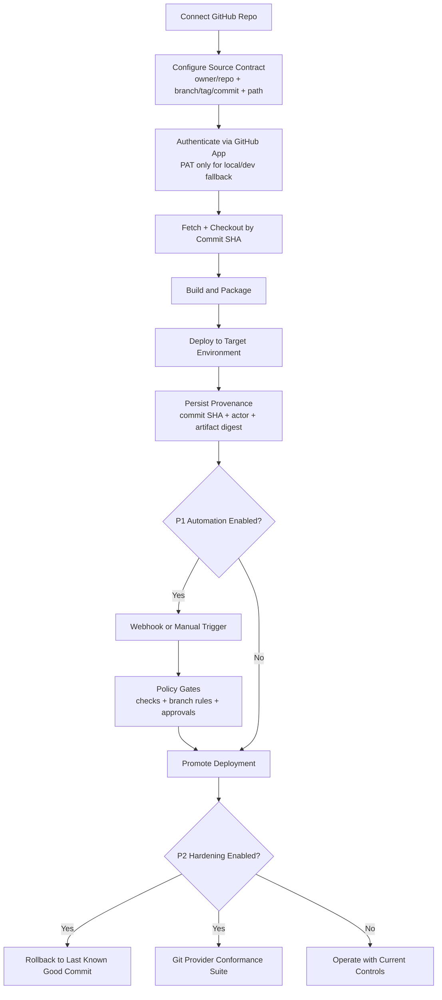

# TODO

## Pro TODO: Architecture Rule Compliance (Rules 1-3 + Flow)

- [x] Phase 1: Freeze canonical ownership model (ADR + scope lock).
  - Define canonical source for shared contracts as `internal/<domain>/` implementations (no SDK-owned canonicals).
  - Define allowed dependency directions and explicit forbidden edges.
  - Publish ownership table for `router`, `runtime`, `simulator`, and `provider` domains.

- [x] Phase 2: Remove alias-only contract layers.
  - Replace alias/re-export blocks in `internal/extensions/contracts/types.go` with canonical concrete types in internal domain packages.
  - Ensure shared interfaces/types are implemented once in internal and consumed downstream without bridges.

- [x] Phase 3: Eliminate bridge/delegator packages.
  - Remove internal bridge wrappers that delegate to `extensions/...` (`internal/extensions/routers`, `internal/extensions/runtimes`, `internal/extensions/simulators`) or convert them into canonical implementations only.
  - Remove any facade package that exists only to forward calls/types.

- [x] Phase 4: Remove duplicate implementations.
  - For each domain (`router`, `runtime`, `simulator`), select one canonical implementation location.
  - Delete duplicate logic in non-canonical layers and update all call sites.

- [x] Phase 5: Enforce flow direction.
  - Remove `internal -> extensions` imports, especially from `internal/extensions/builtins/loaders.go`.
  - Refactor loader/wiring so internal remains upstream of SDK/extensions according to normalized flow.

- [x] Phase 6: Tighten CI architecture checks.
  - Extend `make check-boundary` (or add `make check-architecture`) to fail on:
    - alias-only type re-export files,
    - bridge/delegator packages,
    - duplicate canonical symbols across layers,
    - forbidden direction imports (`internal -> extensions`, `extensions -> internal/platform`).

- [x] Phase 7: Add focused architecture tests.
  - Add unit tests for import graph constraints and package ownership invariants.
  - Add golden tests for allowlist/denylist package patterns.

- [x] Phase 8: Update docs and migration notes.
  - Update `misc/Rules (normalized).md` examples with concrete package paths.
  - Add migration notes for moved types/functions and expected import replacements.

- [x] Exit gate: verify compliance and stability.
  - `make check-boundary`
  - `make check-architecture`
  - `go build ./...`
  - `go test ./...`
  - Block merge unless all architecture checks pass.

- [x] Follow-up: Phase 1 ownership ADR and Phase 7 focused architecture tests are complete.

## Completed Checklist: Router Plugin Configurability (Phase 1)

- [x] Add router command/backend plugin selector (`extensions.routerPlugin`) with sane default.
- [x] Keep default behavior stable by defaulting to `cloudflare` when unset.
- [x] Add explicit guardrails for unsupported router plugin IDs with actionable errors.
- [x] Add unit tests for router plugin selection and validation behavior.
- [x] Update config schema and docs for router plugin configuration.

## Completed Checklist: Router Plugin Kind Dispatch (Phase 2)

- [x] Add first-class `router` plugin kind to extension manifests and kind normalization.
- [x] Extend external plugin install/discovery and CLI kind parsing to support `router`.
- [x] Add built-in router registry (`extensions/routers`) with Cloudflare router plugin.
- [x] Add boundary/connector router dispatch (`ResolveRouter` + `SyncRouter`) through extension layer.
- [x] Refactor DNS sync flow to execute through configured router plugin (`extensions.routerPlugin`).
- [x] Decouple Cloudflare sync engine from workflow app types to avoid import cycles.
- [x] Add/adjust tests for manifest kinds, boundary router resolution, and router CLI behavior.

## Unified Backlog

- [ ] Add a deterministic config contract for DNS/LB sync inputs.
  - Goal: treat `runfabric fabric routing --json` output as the source of truth for DNS intents.
  - Scope: include hostname, strategy (`failover|latency|round-robin`), endpoints, health path, TTL, and stage.

- [ ] Implement a Cloudflare DNS/LB sync tool in repo code.
  - Goal: apply routing intents to Cloudflare using API idempotently (create/update only when drift is detected).
  - Scope: Zone DNS records, LB pools, monitors, and steering policy.
  - Constraint: no destructive mutation without explicit opt-in flag.

- [ ] Add secure secret/env handling for Cloudflare automation.
  - Required: `CLOUDFLARE_API_TOKEN`, `CLOUDFLARE_ZONE_ID`, account/zone context.
  - Goal: fail fast with actionable errors and redact secrets in logs.

- [ ] Add preflight validation and dry-run mode.
  - Goal: print planned Cloudflare changes before apply and block apply on invalid config.
  - Include: endpoint URL validation, duplicate origin detection, and strategy compatibility checks.

- [ ] Add post-deploy integration hook.
  - Goal: run DNS/LB sync automatically after successful `runfabric fabric deploy` in CI.
  - Scope: staged rollout (`dev` -> `staging` -> `prod`) with approval gate for prod.

- [ ] Implement rollback/recovery behavior for DNS changes.
  - Goal: preserve last-good routing config snapshot and restore on failed apply.
  - Include: rollback command and clear operator runbook.

- [ ] Add observability for routing automation.
  - Goal: structured logs and change summary (added/updated/unchanged records, pool health).
  - Include: operation IDs for traceability across deploy and DNS sync steps.

- [ ] Add focused tests for DNS/LB sync logic.
  - Unit: payload generation, diff engine, drift detection, idempotency.
  - Integration: mocked Cloudflare API success/failure/retry paths.
  - E2E: fabric routing JSON -> Cloudflare apply -> verification.

- [ ] Document code-only workflow for operators.
  - Goal: one documented flow from deploy to globally routed traffic using repo scripts and CI only.
  - Include: bootstrap, dry-run, apply, verification, rollback, and troubleshooting.

- [ ] Run focused validation after implementation.
  - `go test ./platform/core/workflow/...`
  - `go test ./internal/cli/router/...`
  - `go test ./platform/extensions/internal/providers/cloudflare/...`
  - `go test ./platform/test/...`

- [ ] Phase 0: Feasibility checklist (go/no-go).
  - Validate plugin protocol impact: confirm adding a new kind does not break existing provider/runtime/simulator handshakes.
  - Validate schema impact: confirm `runfabric.yml` router blocks can be added without breaking existing config parsing and normalization.
  - Validate CLI impact: confirm command namespace (`runfabric router ...`) does not conflict with existing commands/aliases.
  - Validate registry impact: confirm install/discover/version resolution supports `router` kind in local and remote registries.
  - Validate security model: confirm secret handling, token redaction, and policy boundaries for router apply operations.
  - Validate rollback semantics: define minimum reversible operations for DNS/LB changes before enabling default apply.
  - Exit criteria: produce a short ADR with contract draft, risks, and recommendation (`proceed` or `defer`).

- [ ] Define extension contract for `router` (aka `globalrouter`) kind.
  - Goal: provide a provider-neutral interface for global DNS/LB orchestration.
  - Scope: operations for `plan`, `apply`, `status`, `rollback`, and `inspect`.

- [ ] Add manifest and registry support for router extensions.
  - Goal: support discovery/install/version pinning for `router` plugins the same way as provider/runtime/simulator.
  - Constraint: keep backward compatibility for existing plugin kinds.

- [ ] Implement in-process router adapter and external plugin adapter.
  - Goal: allow built-in routers and external routers to share the same call surface.
  - Scope: request/response envelopes, capability handshake, and protocol version checks.

- [ ] Add config schema blocks for router selection and settings.
  - Goal: configure `router` in `runfabric.yml` with stage-aware options and secrets.
  - Include: strategy (`latency|failover|round-robin`), hostname, monitor settings, and provider-specific overrides.

- [ ] Wire router extension into fabric workflow.
  - Goal: after `fabric deploy`, invoke configured router extension to apply global routing automatically.
  - Constraint: support dry-run and explicit opt-in apply mode.

- [ ] Add CLI commands for router lifecycle.
  - Scope: `runfabric router plan|apply|status|rollback|inspect` and JSON output support.
  - Goal: consistent UX with deploy/fabric command families.

- [ ] Implement first router extension target: Cloudflare.
  - Goal: create/update zones, DNS records, LB pools, monitors, and steering policy through extension contract.
  - Include: idempotent diff/apply and safe rollback semantics.

- [ ] Add future router extension targets backlog.
  - Candidates: Route53, NS1, Azure Traffic Manager.
  - Goal: common abstraction with provider-specific capability flags.

- [ ] Add comprehensive tests for router extension framework.
  - Unit: contract validation, manifest parsing, dispatch adapters, diff planning.
  - Integration: mocked router APIs and failure/retry behavior.
  - E2E: fabric deploy -> router apply -> traffic verification workflow.

- [ ] Document extension authoring guide for `router` kind.
  - Goal: enable third-party global routing plugins with examples and best practices.
  - Include: plugin template, required capabilities, and troubleshooting.

- [ ] Add router extension SDK and generator template.
  - Goal: scaffold `router` plugins with `plan|apply|status|rollback|inspect` stubs and tests.

- [ ] Implement desired-vs-actual drift detection and reconcile mode.
  - Goal: compute routing diffs and apply only drifted changes idempotently.

- [ ] Add progressive traffic shifting (canary global rollout).
  - Goal: support staged traffic moves (e.g. 5% -> 25% -> 50% -> 100%) with health gates.

- [ ] Add endpoint quality scoring for weighted steering.
  - Goal: route based on latency/error/saturation metrics, not only healthy/unhealthy.

- [ ] Introduce routing policy guardrails and approvals.
  - Goal: block risky changes (deletes/primary switch) without explicit approval policy.

- [ ] Add multi-router adapters beyond Cloudflare.
  - Targets: Route53, NS1, Azure Traffic Manager.
  - Goal: keep one neutral intent model with provider-specific translators.

- [ ] Harden secrets/identity for router operations.
  - Goal: support secret manager integration and short-lived credentials; enforce log redaction.

- [ ] Persist full before/after snapshots for routing applies.
  - Goal: one-command restore to last-known-good routing state.

- [ ] Add CI pipeline integration for router lifecycle.
  - Flow: `fabric deploy` -> `router plan` -> policy check -> `router apply` -> verification.

- [ ] Add automated failover/chaos verification.
  - Goal: simulate endpoint outages and validate convergence/recovery time objectives.

- [ ] Add routing observability and dashboard outputs.
  - Goal: expose pool health, monitor status, recent changes, and operation IDs for audits.

- [ ] Add local simulation mode for routing decisions.
  - Goal: preview steering outcomes and change plans using synthetic endpoint health inputs.

## Deferred: Enterprise Production Readiness (Engine Track)

- [ ] Define and freeze v1 engine stability contracts.
  - Scope: CLI flags/output compatibility, run state schema compatibility, extension protocol versioning, and deprecation policy.

- [ ] Introduce a formal reliability target matrix.
  - Goal: define SLOs and error budgets for deploy, workflow execution, invoke, logs, and routing apply paths.

- [ ] Harden workflow and deploy idempotency guarantees.
  - Goal: make retry/replay behavior deterministic across controlplane, provider adapters, and state writes.

- [ ] Add persistent audit trail and provenance for critical operations.
  - Scope: deploy/remove/workflow-run/router-apply with actor identity, reason, correlation ID, and before/after metadata.

- [ ] Enforce policy gates for production actions.
  - Include: environment protection rules, required approvals, blocked dangerous flags, and policy-as-code checks.

- [ ] Implement secrets and key management integration.
  - Targets: AWS Secrets Manager, GCP Secret Manager, Vault.
  - Goal: remove static secret usage in CI and local configs for prod stages.

- [ ] Add multi-tenant safety boundaries.
  - Goal: isolate state, credentials, and execution identities by org/project/environment.

- [ ] Expand disaster recovery and backup strategy.
  - Include: state snapshots, journal restoration drills, run replay recovery tests, and documented RTO/RPO objectives.

- [ ] Build full observability for runtime and controlplane.
  - Scope: traces, metrics, logs, and audit events with standard correlation fields and dashboards.

- [ ] Add supply chain and release hardening.
  - Include: SBOM generation, signed artifacts, checksum verification, dependency vulnerability gates, and provenance attestations.

- [ ] Add scale and resilience test suites.
  - Cases: high-concurrency workflow runs, provider API throttling, network partitions, state backend latency spikes.

- [ ] Add enterprise documentation track.
  - Scope: production operations guide, security model, compliance mapping (SOC2/ISO style controls), and incident response playbooks.

- [ ] Define GA quality gates for engine releases.
  - Goal: ship only when mandatory checks, reliability thresholds, migration checks, and docs-sync gates all pass.

## Deferred: GitHub Integration for PaaS Delivery (Engine Track)

### P0 (MVP: Connect + Pull + Deterministic Deploy)

- [ ] Define repo source contract in config and API.
  - Include: `owner/repo`, branch/tag/commit pin, path within repo, auth mode, and build context.

- [ ] Add secure GitHub auth integration.
  - Options: GitHub App installation flow (preferred), PAT fallback for local/dev only.
  - Constraint: never store raw tokens in plain config or logs.

- [ ] Implement source fetch and checkout worker.
  - Goal: fetch repository code by commit SHA deterministically for reproducible builds.

- [ ] Add buildpack/executor contract for pulled code.
  - Goal: detect runtime and run standardized build/test/package steps before deploy.

- [ ] Persist source provenance in deployment records.
  - Include: commit SHA, actor, workflow run ID, PR number, and artifact digest.

- [ ] Add focused validation for P0.
  - `go test ./internal/cli/...`
  - `go test ./platform/deploy/...`
  - `go test ./platform/core/state/...`

### P1 (Automation: Change Triggers + Policy Gates)

- [ ] Add change detection and trigger strategy.
  - Scope: webhook ingestion (push, PR merge, release), manual sync, and scheduled poll fallback.

- [ ] Add deployment gating from Git events.
  - Include: required checks, branch policies, environment approvals, and protected production promotions.

- [ ] Add Git provider abstraction to engine deploy pipeline.
  - Goal: support GitHub first, then extendable to GitLab/Bitbucket without changing core flow.

- [ ] Add focused validation for P1.
  - `go test ./platform/deploy/...`
  - `go test ./platform/core/state/...`
  - `go test ./platform/test/...`

### P2 (Hardening: Rollback + Multi-Provider Expansion)

- [ ] Add rollback-to-commit support.
  - Goal: one-command rollback to last-known-good commit and artifact.

- [ ] Add advanced deploy provenance/audit correlation.
  - Include: cross-link deploy, run, and approval events by correlation ID.

- [ ] Add conformance suite for additional git providers.
  - Goal: ensure identical behavior and policy enforcement across GitHub/GitLab/Bitbucket integrations.

- [ ] Add focused validation for P2.
  - `go test ./internal/cli/...`
  - `go test ./platform/deploy/...`
  - `go test ./platform/core/state/...`
  - `go test ./platform/test/...`
