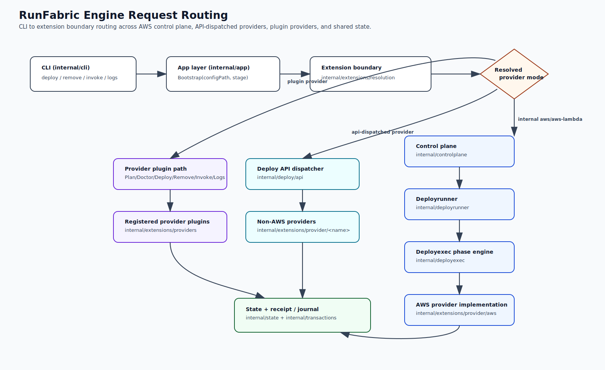

# Architecture

In this repo the Go engine lives at the repository root. CLI command wiring lives under `internal/cli/` (split by command domain), and app orchestration contracts live under `internal/app/`.

Shared contracts should live under `platform/core/contracts/` to avoid stale cross-package contract copies.

---

## Quick navigation

- **End-to-end routing**: Deploy flow (CLI → app → provider routing)
- **Visual flow**: Engine request routing diagram
- **Extension boundary**: Provider/runtime resolution boundary
- **Where provider implementations live**: Provider code layout
- **Why AWS is special**: Control plane + deployrunner + deployexec

---

## Deploy flow: CLI → app → controlplane / deployapi / deployexec

How **deployrunner**, **controlplane**, **deployapi**, **deployexec**, and **deployplan** connect to the CLI and provider actions.

### Engine request routing diagram



### 1. Entry: CLI commands

| CLI command             | File                                | Calls                                         |
| ----------------------- | ----------------------------------- | --------------------------------------------- |
| `runfabric deploy`      | `internal/cli/lifecycle/deploy.go`  | `internal/app.Deploy(configPath, stage, ...)` |
| `runfabric remove`      | `internal/cli/lifecycle/remove.go`  | `internal/app.Remove(configPath, stage, ...)` |
| `runfabric invoke run`  | `internal/cli/invocation/invoke.go` | `internal/app.Invoke(configPath, stage, ...)` |
| `runfabric invoke logs` | `internal/cli/invocation/logs.go`   | `internal/app.Logs(configPath, stage, ...)`   |

### 2. App layer: routing by provider

**Location:** `internal/app/app.go`

CLI packages call the internal app boundary, which currently delegates to `platform/core/workflow/app` while exposing a stable `AppService` contract for future injection/mocking and stricter layering.

Routing is selected by boundary resolution mode (not ad-hoc provider checks in each command):

- **Internal providers** (currently `aws`, `aws-lambda`) → controlplane + deployrunner path.
- **API-dispatched providers** (provider IDs in the API capability set) → `internal/deploy/api` for deploy/remove/invoke/logs.
- **Plugin providers** (non-internal, non-API dispatch) → provider interface path via lifecycle (`Plan/Doctor/Deploy/Remove/Invoke/Logs`).
- **Unknown provider** → hard error (`provider "<name>" not registered`) rather than lifecycle stub fallback.

### Extension boundary (`internal/extensions/resolution`)

- Central place for provider/runtime resolution in the Go engine.
- Builds built-in provider registry, registers API-backed provider adapters, and merges external plugins from `RUNFABRIC_HOME/plugins`.
- Preserves built-in precedence on ID conflicts.
- Keeps AWS providers (`aws`, `aws-lambda`) internal while the contract stabilizes.

### 3. Control plane (`internal/controlplane/`)

Used only for **AWS** deploy/remove. Lock + journal; **RunDeploy** → **deployrunner.Run** with AWS adapter.

### 4. Deployrunner (`internal/deployrunner/`)

**Run(ctx, adapter, cfg, stage, root, journal)** → adapter.BuildPlan → plan.Execute; on error plan.Rollback.

### 5. AWS adapter and DeployPlan (`providers/aws/`)

**adapter.BuildPlan** → **NewDeployPlan**; **DeployPlan.Execute** builds **deployexec.Engine** (phases in deploy_resume.go), runs engine, saves receipt.

### 6. Deployexec (`internal/deployexec/`)

Generic phase engine: list of phases with checkpoints; journal records progress. AWS injects phase list in **providers/aws/deploy_resume.go**.

### 7. Deploy API (`internal/deploy/api/`)

For **non-AWS** providers: deploy/remove/invoke/logs via provider REST/SDK.

- Uses a single capability registry (`internal/deploy/api/registry.go`) with one provider entry per non-AWS provider.
- `run.go`, `remove.go`, `invoke.go`, and `logs.go` all dispatch through that unified registry (not separate per-operation maps).
- Provider dispatch uses unified plugin-facing request/response interfaces.

### 7.1 CLI deploy runner status (`internal/deploy/cli/`)

- `internal/deploy/cli` is not part of the active deploy lifecycle path.
- Supported lifecycle routing in the engine is API/plugin based (`internal/deploy/api`) plus AWS controlplane.
- Docs and roadmap treat CLI deploy runners as out of active feature development unless explicitly reactivated.

### 8. Recovery and deploy_resume

**runfabric recover** can call **awsprovider.ResumeDeploy** with journal from file; same phase engine, completed checkpoints skipped.

---

## Provider code layout

Provider implementations live under **`platform/extensions/internal/providers/<name>/`** (with API dispatch in `internal/deploy/api/`).

1. **Segregated actions** – deploy, remove, invoke, logs (in `deploy.go`, `remove.go`, `invoke.go`, `logs.go` or `api_*.go`). Orchestration in `internal/deploy/api/` or control plane for AWS.
2. **Resources and triggers** – each provider has **`resources/`** and **`triggers/`** per capability matrix (`internal/planner/capability_matrix.go`).

### Structure

```
platform/extensions/internal/providers/
├── aws/          # adapter, deploy_plan.go, deploy_resume.go, triggers/, resources/
├── cloudflare/   # api_*.go, triggers/
├── vercel/       # deploy, remove, invoke, logs, triggers/
├── netlify/      # ...
├── fly/          # ...
├── gcp/          # ...
├── azure/        # ...
├── kubernetes/   # api_*.go, triggers/
├── alibaba/      # ...
├── digitalocean/ # ...
└── ibm/          # ...
```

### Shared helpers

- **`internal/apiutil/`** – HTTP and result helpers (Env, APIGet, APIPost, BuildDeployResult, etc.).
- **`internal/deploy/api/`** – Run/Remove/Invoke/Logs dispatch to providers; no provider-specific logic.

### Migrated providers (API-based)

| Provider               | Deploy | Remove | Invoke | Logs | Location                                               |
| ---------------------- | ------ | ------ | ------ | ---- | ------------------------------------------------------ |
| digitalocean-functions | ✅     | ✅     | ✅     | ✅   | `platform/extensions/internal/providers/digitalocean/` |
| cloudflare-workers     | ✅     | ✅     | ✅     | ✅   | `platform/extensions/internal/providers/cloudflare/`   |
| vercel                 | ✅     | ✅     | ✅     | ✅   | `platform/extensions/internal/providers/vercel/`       |
| netlify                | ✅     | ✅     | ✅     | ✅   | `platform/extensions/internal/providers/netlify/`      |
| fly-machines           | ✅     | ✅     | ✅     | ✅   | `platform/extensions/internal/providers/fly/`          |
| gcp-functions          | ✅     | ✅     | ✅     | ✅   | `platform/extensions/internal/providers/gcp/`          |
| azure-functions        | ✅     | ✅     | ✅     | ✅   | `platform/extensions/internal/providers/azure/`        |
| kubernetes             | ✅     | ✅     | ✅     | ✅   | `platform/extensions/internal/providers/kubernetes/`   |
| ibm-openwhisk          | ✅     | ✅     | ✅     | ✅   | `platform/extensions/internal/providers/ibm/`          |
| alibaba-fc             | ✅     | ✅     | ✅     | ✅   | `platform/extensions/internal/providers/alibaba/`      |
